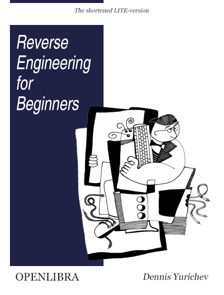

# Reverse Engineering for Beginners
> 

## Chapter 1

The simple function
>
C/C++ Code

```bash
touch 1_test.c && 1_test.c
```

```C/C++
int f()
{
	return 123;	
};
```
Let's go to compile this!

#### Output:

- x86 
```assembly
f:
	mov	eax, 123
	ret
```
- x86_64
``` bash
gcc 1_test.c -S
```

```assembly
f:
	pushq	%rbp
	movq	%rsp, %rbp
	movl	$123, %eax
	popq	%rbp
	ret
```


- ARM
```assembly

```
- MIPS
```assembly

``` 
## Chapter 2
>

2.1 Void function
The simple function that you can write in C is
  
```C
void f()
{
	return;
};
```
>

compile this code
You can compile with [https://godbolt.org/](godbolt)
	Or 
You can use [https://dogbolt.org/](dogbolt)

> Output:
- ARM platform:

``` assembly
f:
        push    {r7}
        add     r7, sp, #0
        nop
        mov     sp, r7
        ldr     r7, [sp], #4
        bx      lr
```
- ARM with keil/2013(ASM Output)
```assembly

```
- x86 with gcc 
```assembly
f:
	push1 %ebp
	mov1 %esp,%ebp
	jmp .L1
.L1:
	leave
	ret
```
- x86 with msvc 
```assembly
_f	PROC
	push	ebp
	mov	eb, esp
	pop	ebp
	ret	0
_f	ENFP

```
- x86_64
